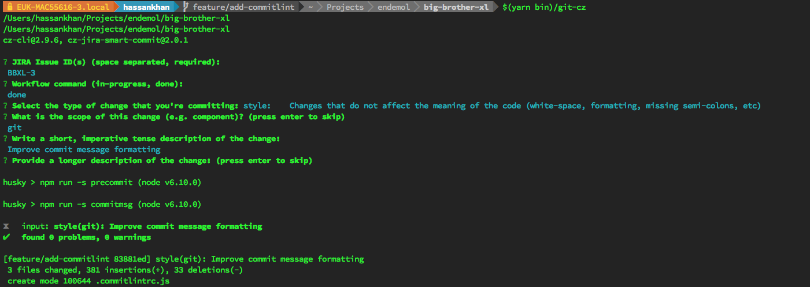

# @endemolshinegroup/cz-jira-smart-commit

[![MIT Licensed][icon-license]][link-license]
[![NPM Version][icon-npm]][link-npm]
[![Build Status][icon-ci]][link-ci]
[![Greenkeeper Status][icon-greenkeeper]][link-greenkeeper]

[![Code Issues][icon-issues]][link-issues]
[![Codebase Maintainability][icon-maintainability]][link-maintainability]
[![Test Coverage][icon-coverage]][link-coverage]
[![Jest][icon-jest]][link-jest]

[![Commitizen][icon-commitizen]][link-commitizen]
[![Semantic Release][icon-semantic-release]][link-semantic-release]
[![Prettier][icon-prettier]][link-prettier]

A Commitizen adapter for [JIRA smart commits][link-smart-commits].



[link-smart-commits]: https://confluence.atlassian.com/display/FISHEYE/Using+smart+commits

## Installation

```bash
yarn add -D @endemolshinegroup/cz-jira-smart-commit
```

Add the following to your `.czrc`:

```json
{
  "path": "@endemolshinegroup/cz-jira-smart-commit"
}
```

## Usage

```bash
$(yarn-bin)/git-cz
```

## Configuration

The adapter can be customised by specifying additional options in `.czrc`:

```json
{
  "path": "@endemolshinegroup/cz-jira-smart-commit",
  "@endemolshinegroup/cz-jira-smart-commit": {
    "pullRequestsOnly": true,
    "scopes": {
      "api": "For API commits",
      "site": "For frontend commits",
      "docs": "For documentation commits"
    }
  }
}
```

[icon-license]: https://img.shields.io/github/license/EndemolShineGroup/cz-jira-smart-commit.svg?longCache=true&style=flat-square
[link-license]: LICENSE
[icon-npm]: https://img.shields.io/npm/v/@endemolshinegroup/cz-jira-smart-commit.svg?longCache=true&style=flat-square
[link-npm]: https://www.npmjs.com/package/@endemolshinegroup/cz-jira-smart-commit
[icon-ci]: https://img.shields.io/travis/com/EndemolShineGroup/cz-jira-smart-commit.svg?longCache=true&style=flat-square
[link-ci]: https://travis-ci.com/EndemolShineGroup/cz-jira-smart-commit
[icon-greenkeeper]: https://img.shields.io/badge/greenkeeper-enabled-brightgreen.svg?longCache=true&style=flat-square
[link-greenkeeper]: https://greenkeeper.io/

[icon-issues]: https://img.shields.io/codeclimate/issues/EndemolShineGroup/cz-jira-smart-commit.svg?longCache=true&style=flat-square
[link-issues]: https://codeclimate.com/github/EndemolShineGroup/cz-jira-smart-commit/issues
[icon-maintainability]: https://img.shields.io/codeclimate/maintainability/EndemolShineGroup/cz-jira-smart-commit.svg?longCache=true&style=flat-square
[link-maintainability]: https://codeclimate.com/github/EndemolShineGroup/cz-jira-smart-commit
[icon-coverage]: https://img.shields.io/codecov/c/github/EndemolShineGroup/cz-jira-smart-commit/develop.svg?longCache=true&style=flat-square
[link-coverage]: https://codecov.io/gh/EndemolShineGroup/cz-jira-smart-commit

[icon-jest]: https://img.shields.io/badge/tested_with-jest-99424f.svg?longCache=true&style=flat-square
[link-jest]: https://jestjs.io/

[icon-commitizen]: https://img.shields.io/badge/commitizen-friendly-brightgreen.svg?longCache=true&style=flat-square
[link-commitizen]: http://commitizen.github.io/cz-cli/
[icon-semantic-release]: https://img.shields.io/badge/%20%20%F0%9F%93%A6%F0%9F%9A%80-semantic--release-e10079.svg?longCache=true&style=flat-square
[link-semantic-release]: https://semantic-release.gitbooks.io/semantic-release/
[icon-prettier]: https://img.shields.io/badge/code_style-prettier-ff69b4.svg?longCache=true&style=flat-square
[link-prettier]: https://prettier.io/

